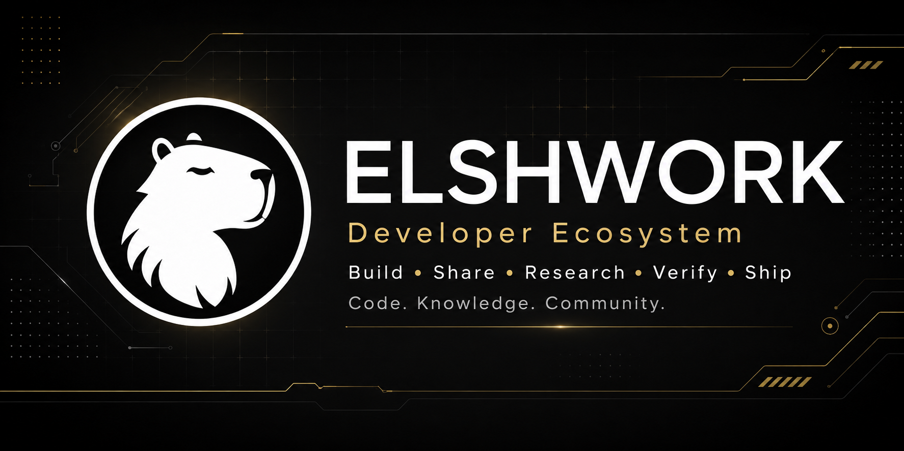
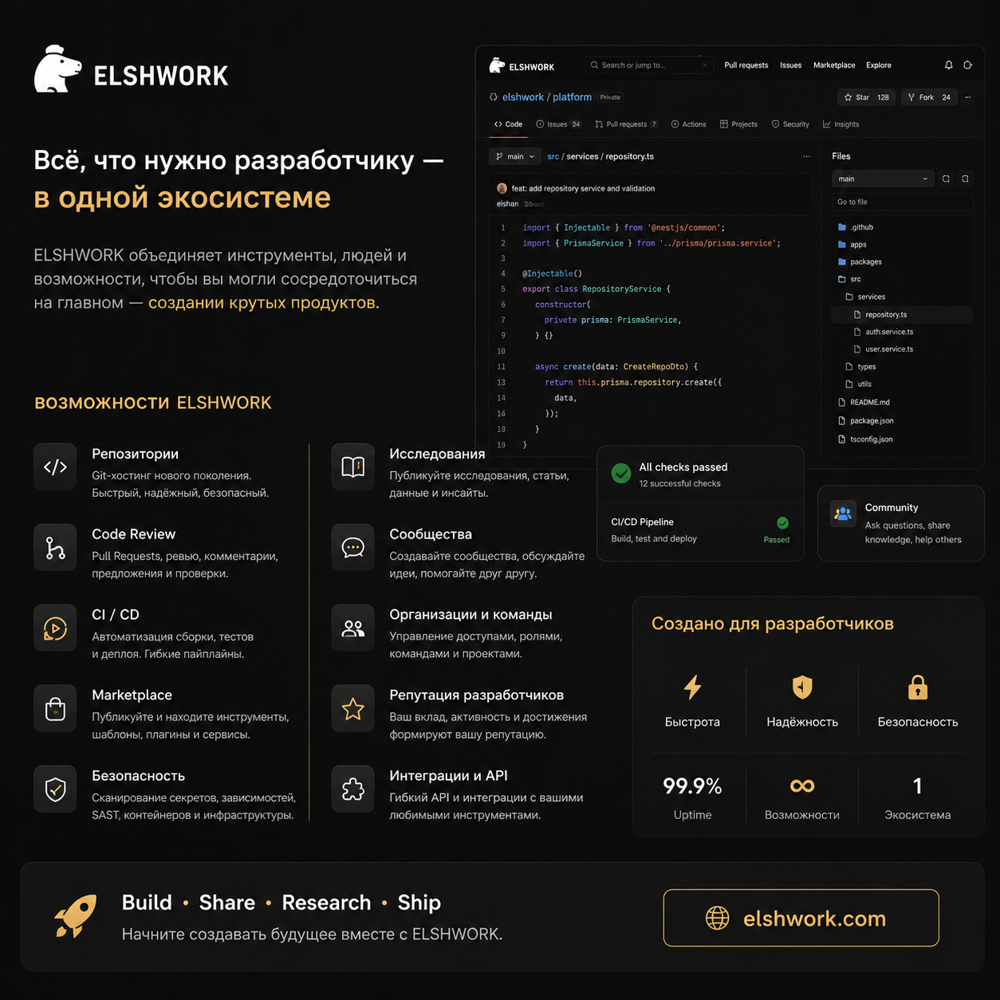
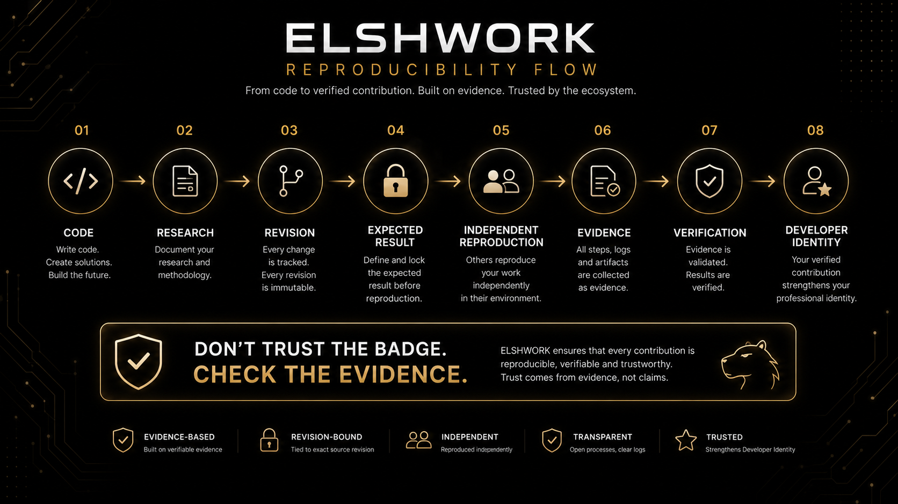

<p align="center">
  
</p>
# ELSHWORK

**ELSHWORK — Developer Ecosystem for code, research, collaboration and verified professional reputation.**

[www.elshwork.com](https://www.elshwork.com)

---

## What is ELSHWORK?

ELSHWORK is a developer ecosystem designed to bring software development, research, collaboration, professional identity and verified contributions into one connected platform.

The goal is not to build just another code hosting service.

ELSHWORK is being developed as an environment where developers can:

- create and manage repositories;
- collaborate through Pull Requests and Code Review;
- run CI/CD workflows;
- publish releases and packages;
- work in organizations and teams;
- publish research;
- request expert reviews;
- perform independent reproductions;
- build verified professional reputation;
- discover tools through a marketplace;
- communicate and collaborate inside one ecosystem.

---
## ELSHWORK Ecosystem

<p align="center">
  
</p>

ELSHWORK combines repositories, collaboration, research, reproducibility,
verification, security, Developer Identity, organizations, packages and
Marketplace into one connected developer ecosystem.
## Core idea

Most developer platforms can show what a person published.

ELSHWORK is also focused on showing **why a result can be trusted**.

One of the key directions of the project is the connection between:

```text
Code
↓
Research
↓
Reproducibility
↓
Verification
↓
Verified Contribution
↓
Professional Reputation
```

This concept is being developed through:

- **Reproducibility Passport**
- **Independent Reproduction**
- **Verification History**
- **Developer Identity**
- **Domain Reputation**
- **Verified Expertise**
- **ELSH Score**

---

## Reproducibility

A research result should not be treated as verified simply because someone marked it as verified.

ELSHWORK is designed around the idea that every important result should be connected to its evidence.
<p align="center">
  
</p>

A reproducibility workflow may include:

```text
Research
↓
Revision
↓
Repository
↓
Commit
↓
Environment
↓
Expected Result
↓
Independent Reproduction
↓
Verification History
```

Independent reproductions are bound to a specific research revision.

If a new revision changes the methodology, source code or expected result, previous reproductions do not automatically verify the new revision.

This prevents a common problem where verification of an older result is incorrectly treated as verification of a newer one.

---

## Developer Identity

ELSHWORK Developer Identity is intended to represent real, verified contribution rather than popularity alone.

Reputation and expertise should be derived from confirmed backend events such as:

- commits;
- merged Pull Requests;
- code reviews;
- accepted answers;
- publications;
- independent reproductions;
- releases;
- packages;
- security contributions;
- other verified contribution events.

Users should never be able to grant themselves reputation, skills or achievements through a client request.

---

## Platform areas

ELSHWORK currently includes or is developing the following areas:

### Repositories

Repository hosting, file management, history, permissions and Git-compatible workflows.

### Pull Requests & Code Review

Review workflows, inline comments, suggestions, merge gates and collaboration tools.

### Forge

CI/CD pipelines, job dependencies, retries, cancellation and execution workflows.

### Security

Repository scanning, secret detection, dependency checks, SAST, container and IaC analysis.

### Packages & Releases

Package registry, versioning, release assets, checksums, provenance and SBOM support.

### Research

Research publishing, revisions, citations, expert review and reproducibility workflows.

### Developer Identity

ELSH Score, domain reputation, verified expertise, achievements and contribution history.

### Organizations & Teams

Organizations, nested teams, invitations, repository grants, ownership and governance.

### Marketplace

Developer tools, extensions, templates and other ecosystem products.

### Notifications

Unified delivery workflow for in-app, email, push and webhook notifications.

### Search

Global search across repositories, code, issues, users, organizations, research and other platform entities.

### Administration

Scoped platform administration with strict privacy and security boundaries.

---

## Security principles

Security boundaries in ELSHWORK are enforced by the backend.

Important platform principles include:

- private repositories remain private;
- organization membership does not automatically grant write access;
- platform administrators do not automatically receive access to private repository contents;
- critical administrative and moderation actions are audited;
- reputation cannot be issued directly from the client;
- external payment, AI, search and infrastructure integrations must not be faked;
- external services are connected through adapters.

---

## Architecture

The current ELSHWORK architecture is based on a monorepo and includes:

- **NestJS API**
- **React / Vite Web**
- **PostgreSQL**
- **Prisma**
- **Redis**
- **Docker**
- **Git Smart HTTP**
- **Object Storage abstraction**
- **Forge Runner**
- **WebSocket / realtime infrastructure**

The platform is designed so that external infrastructure can be replaced or extended through adapters.

---

## Future technologies

ELSHWORK is also exploring technologies beyond the core platform.

One example is the experimental **`.elsh`** file format.

The long-term concept for `.elsh` is a Persistent Digital Object — a self-describing digital object that can carry:

- identity;
- provenance;
- history;
- relationships;
- trust information;
- intent;
- permissions;
- integrity data;
- payloads.

The format is currently experimental.

---

## Project status

ELSHWORK is under active development.

The project is currently focused on:

- platform stabilization;
- localization;
- Research Trust & Reproducibility;
- Developer Identity;
- Marketplace;
- global payment infrastructure;
- AI integration;
- production deployment.

---

## Philosophy

ELSHWORK is built around a simple principle:

> **Do not trust the badge. Check the evidence.**

And for research:

> **Don't just publish results. Prove they can be reproduced.**

---

## Website

**https://www.elshwork.com**

---

## License

Licensing terms for the public repository and individual ELSHWORK components will be defined separately.

Do not assume that all ELSHWORK source code is open source unless explicitly stated.

---

## ELSHWORK

**Build. Share. Research. Verify. Ship.**
